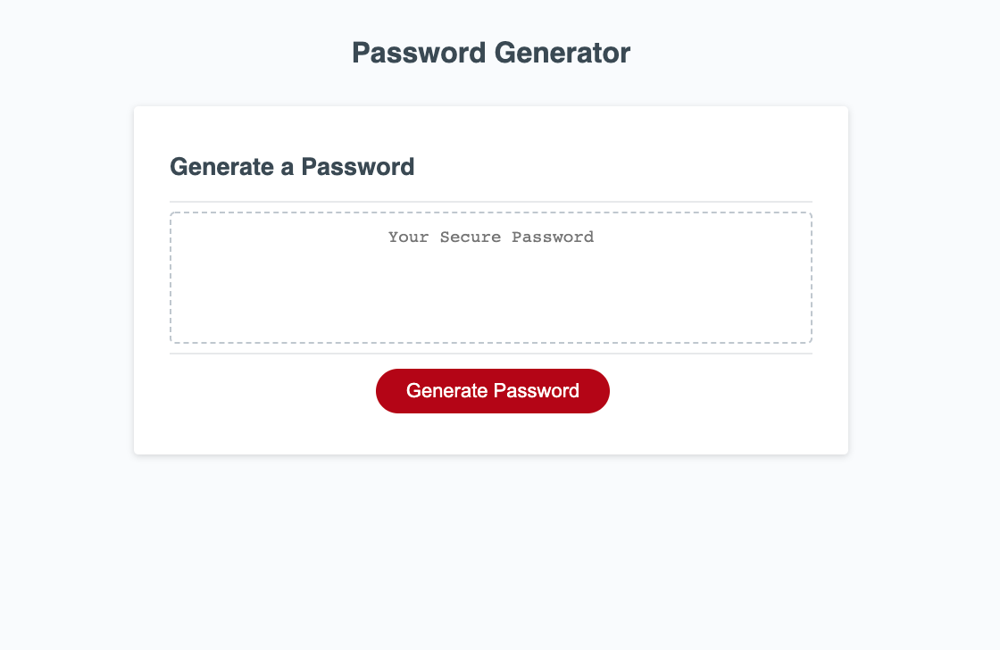
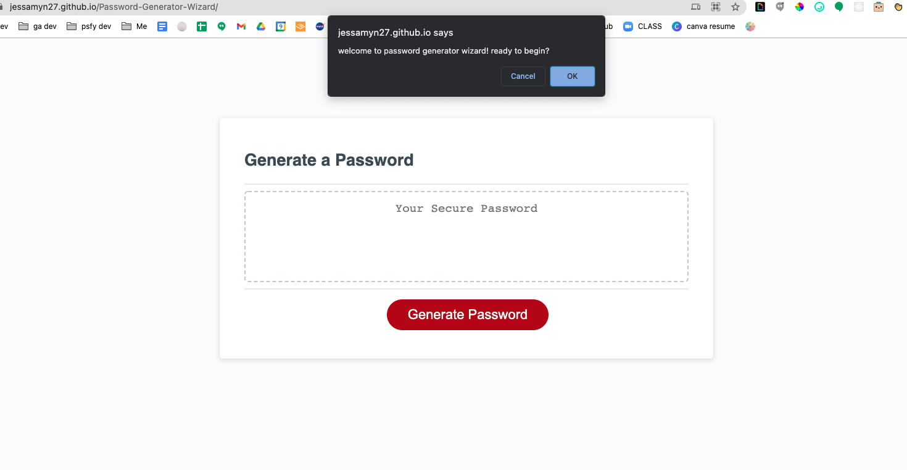
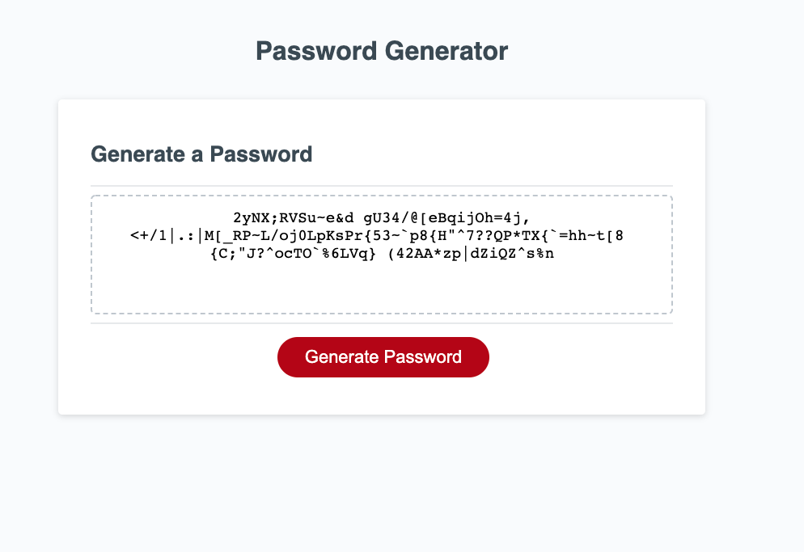

# Password-Generator-Wizard

#### Created a Password Generator using javascript prompts, alerts, confirm pop ups, arrays, functions, if/else stmnts, click event listeners and DOM traversal

## Table of Contents

**[Quick Links](#Quick-Links)** 
**[First Looks](#First-Looks)** 
**[Wireframes](#Wireframes)** 
**[Bugs and Known Issues](#Bugs-and-Known-Issues)** 
**[Next Steps to Continue](#Next-Steps-to-Continue)** 
**[Wireframes OR SudoCode of Acceptance Criteria](Wireframes-OR-SudoCode-of-Acceptance-Criteria)** 
**[Acceptance Criteria](#Acceptance-Criteria)** 
**[Bonus](#Bonus)** 
**[Deliverables](#Deliverables)** 
**[License](#License)** 

## Quick Links

- click here to view --> [final website](https://jessamyn27.github.io/Password-Generator-Wizard/)

- click here too view --> [homework assignment details](https://github.com/the-Coding-Boot-Camp-at-UT/UTA-VIRT-FSF-FT-06-2021-U-LOL/tree/master/03-JavaScript/02-Homework)

- click here to view --> [README GUIDE from UT](https://github.com/the-Coding-Boot-Camp-at-UT/UTA-VIRT-FSF-FT-06-2021-U-LOL/blob/master/01-HTML-Git-CSS/02-Homework/Homework-Guide/README.md)

## First Looks

# 

# 

# 

## Wireframes OR SudoCod

## Bugs and Known Issues

- more error handling for user input in the length prompt
- array to choose random character not resetting, user can keep clicking button and adding to the array from before
- timeout function for every pop up that asks for more time or refreshes screen?

## Next Steps to Continue

### Next Steps for App UI and Functionality

- button to reset
- button to copy the code in one click
- more timeout and setInterval functionality to handle pop up screens being idle
- convert all pop up screens to UI in the html and in the body of the webpage
- add checkboxes and on screen error handling for all user input
- cleaner and more interesting UI
- link to password savers and auto copy exensions apps?

## Wireframes OR SudoCode of Acceptance Criteria

- password generator sudo code out each step - goal is to create a new secure password
- USER clicks button to generate password
- prompt pops up:
- “welcome to password generator wizard! you will be selecting length and at least 1 character type, ready to begin? yes / no 
- USER selects yes and new prompt appears:
- “please enter the length of characters you would like for your password, it must be more than 8 and less than 128
- clicks submit button on prompt
- if accepted, new prompt and store info
- else: error validation message if: not number / less than 8 / more than 128 and request to submit again
- prompt for lowercase boolean yes or no button to click
- prompt for uppercase boolean yes or no button to click
- prompt for numeric boolean yes or no button to click
- prompt for special characters boolean yes or no button to click to check validation answer for each choice should be validated (set to true or false) and at - - least 1 char type should be selected:
- if yes/true to at least one, function to generate random password with yes criteria:
- password is generated that matches the selected criteria
- when password is generated display in alert or on webpage in html
- if no/false to all, validation message “I’m sorry, you must choose at least one character type, would you like to run the password generator wizard again?”
- yes (reset to welcome screen) button to click
- no (hide prompt and reset to main) button to click
- timeout function if wizard is incomplete that asks if they need more time
- yes? reset timeout function
- no? reset password generator

## Acceptance Criteria

- GIVEN I need a new, secure password
- WHEN I click the button to generate a password
- THEN I am presented with a series of prompts for password criteria
- WHEN prompted for password criteria
- THEN I select which criteria to include in the password
- WHEN prompted for the length of the password
- THEN I choose a length of at least 8 characters and no more than 128 characters
- WHEN asked for character types to include in the password
- THEN I confirm whether or not to include lowercase, uppercase, numeric, and/or special characters
- WHEN I answer each prompt
- THEN my input should be validated and at least one character type should be selected
- WHEN all prompts are answered
- THEN a password is generated that matches the selected criteria
- WHEN the password is generated
- THEN the password is either displayed in an alert or written to the page

## Grading Requirements

- This homework is graded based on the following criteria: 

### Technical Acceptance Criteria: 40%

* Satisfies all of the above acceptance criteria.

### Deployment: 32%

* Application deployed at live URL.

* Application loads with no errors.

* Application GitHub URL submitted.

* GitHub repository contains application code.

### Application Quality: 15%

* Application resembles the mock-up functionality provided in the homework instructions.

### Repository Quality: 13%

* Repository has a unique name.

* Repository follows best practices for file structure and naming conventions.

* Repository follows best practices for class/id naming conventions, indentation, quality comments, etc.

* Repository contains multiple descriptive commit messages.

* Repository contains quality readme with description, screenshot, link to deployed application.

## Review

You are required to submit BOTH of the following for review:

* The URL of the deployed application.

* The URL of the GitHub repository that contains your code. Give the repository a unique name and include a README file that describes the project.

### Bonus

- 1. Transpile JS for compatibility with other browsers (Safari/iOS)
- 2. Use of the Airbnb style guide
- 3. Unit tests for critical functions
- 4. Use JSDocs 3 pattern for comments
- 5. Write a list of bugs or known issues for your implementation if needed

### Deliverables

- 1. All source files (ES6 and SCSS)
- 2. HTML and CSS files (unminified)
- 3. GitHub repository link in UT Portal
- 4. Gitpages live website link in UT Portal

### License

[MIT License](https://opensource.org/licenses/MIT)

**[Back Up To Top](#Password-Generator-Wizard)**
